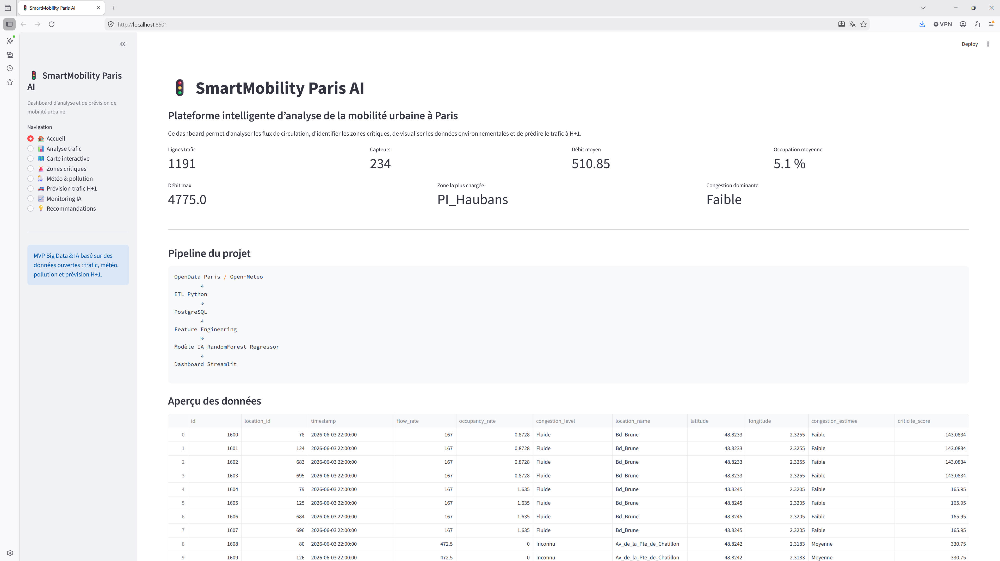
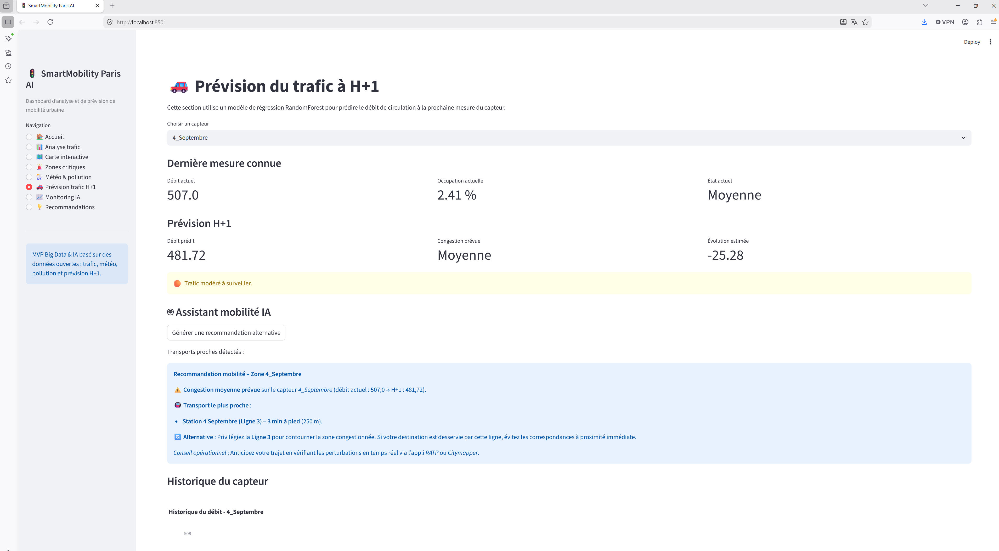
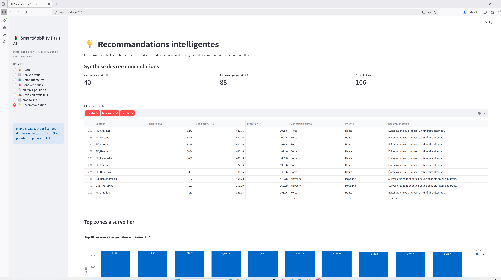

# 🚦 SmartMobility Paris AI

## 📌 Présentation

SmartMobility Paris AI est une plateforme d'analyse et de prévision du trafic routier à Paris basée sur des données ouvertes.

Le projet combine :

* Data Engineering (ETL)
* Base de données PostgreSQL
* Machine Learning
* Dashboard interactif Streamlit
* Intelligence Artificielle Générative (Mistral AI)

L'objectif est d'aider les usagers et les collectivités à anticiper les congestions routières et à proposer des alternatives de mobilité.

---

## 🏗️ Architecture du projet

```text
OpenData Paris
Open-Meteo
OpenAQ

        ↓

ETL Python

        ↓

PostgreSQL

        ↓

Feature Engineering

        ↓

Modèle IA de prévision trafic H+1
(Random Forest Regressor)

        ↓

Dashboard Streamlit

        ↓

Assistant IA mobilité (Mistral)
```

---

## ⚙️ Technologies utilisées

### Data Engineering

* Python
* Pandas
* Requests

### Base de données

* PostgreSQL
* SQLAlchemy

### Machine Learning

* Scikit-Learn
* Random Forest Regressor

### Dashboard

* Streamlit
* Plotly

### IA Générative

* Mistral AI API

### DevOps

* Docker
* Git
* GitHub

---

## 📂 Structure du projet

```text
smartmobility-ai/

dashboard/
 └── app.py

etl/
 ├── traffic_etl.py
 ├── weather_etl.py
 ├── pollution_etl.py
 ├── prepare_forecast_dataset.py
 └── audit_sensors.py

models/
 └── train_forecast_model.py

sql/
 └── init_db.sql

data/
 ├── raw/
 ├── processed/
 └── external/

docker/
docs/
notebooks/
tests/

requirements.txt
docker-compose.yml
README.md
```

---

## 🚗 Fonctionnalités

### Analyse du trafic

* Visualisation des débits de circulation
* Analyse des taux d'occupation
* Analyse par capteur

### Carte interactive

* Affichage des capteurs sur une carte
* Niveau de congestion par zone
* Filtrage dynamique

### Analyse des zones critiques

* Classement des zones les plus congestionnées
* Score de criticité

### Météo et pollution

* Température
* Humidité
* Vent
* NO2
* PM10
* PM2.5

### Prévision du trafic H+1

Le modèle IA prédit le débit futur de circulation à partir :

* du trafic actuel
* du trafic précédent
* du taux d'occupation
* de variables temporelles

### Assistant IA Mobilité

Lorsqu'une congestion est détectée :

* recherche des transports à proximité
* génération d'une recommandation personnalisée
* proposition d'alternatives de mobilité

---

## 📸 Aperçu du Dashboard

### Accueil



### Carte Interactive


### Prévision H+1



### Recommandations IA



---

## 📊 Résultats du modèle IA

### Prévision H+1

Performance obtenue :

* MAE : ~12.75
* RMSE : ~21.24
* R² : ~0.985

Le modèle explique environ 98 % de la variance du trafic futur.

---

## 🚀 Installation

### Cloner le projet

```bash
git clone https://github.com/kyeahoo7/smartmobility-ai.git
cd smartmobility-ai
```

### Installer les dépendances

```bash
pip install -r requirements.txt
```

### Configurer les variables d'environnement

Créer un fichier `.env`

```env
DB_HOST=localhost
DB_PORT=5433
DB_NAME=smartmobility
DB_USER=admin
DB_PASSWORD=admin

MISTRAL_API_KEY=YOUR_API_KEY
```

### Initialiser PostgreSQL

```bash
psql -f sql/init_db.sql
```

### Lancer les ETL

```bash
python etl/traffic_etl.py
python etl/weather_etl.py
python etl/pollution_etl.py
```

### Préparer le dataset

```bash
python etl/prepare_forecast_dataset.py
```

### Entraîner le modèle

```bash
python models/train_forecast_model.py
```

### Lancer le dashboard

```bash
streamlit run dashboard/app.py
```

---

## 📈 Perspectives d'amélioration

* Prévision multi-horizons (H+3, H+6, H+24)
* Détection automatique d'incidents
* Historisation complète des données
* Intégration des données RATP / Île-de-France Mobilités
* Optimisation d'itinéraires en temps réel
* Déploiement Cloud

---

## 👨‍💻 Auteur

Projet réalisé dans le cadre du Master Big Data & Intelligence Artificielle.

Développé par Youness MOSTEFAOUI et Yani GHANDRICHE.
